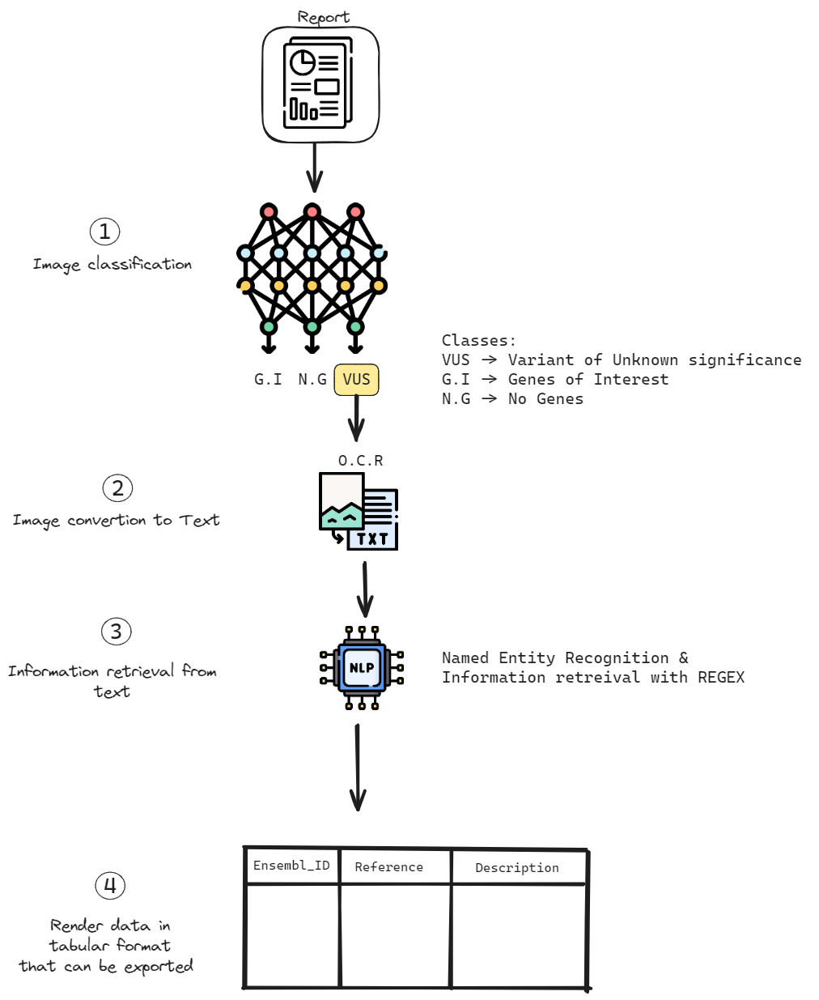

# PDF READER

App available with this [Link](https://f1-pdf-reader.streamlit.app/)

## Workflow

### 1 - Image classification

When you upload your PDF, it is initially converted into an image. Subsequently, it undergoes processing through an
image classification model, which filters the report and retains only the images containing the relevant data that we
aim to extract.

### 2 - Image conversion

Once the images of interest are chosen, we utilize OCR (Optical Character Recognition) to convert these images into
text. For those who may not be familiar with the term, OCR is a technology that enables the extraction of text from
images. In the context of this application, we have employed [docTR OCR](https://github.com/mindee/doctr), developed by
Mindee, to carry out the OCR
process.

### 3 - Information retrieval

In this stage, we applied a customized Spacy Named Entity Recognition (NER) model, complemented by regular expression (
regex)
patterns, to extract the pertinent information. For those not familiar with the term, NER is a technology used to
identify and classify named entities, such as names, locations, within a given text.

### 4 - Reorganize the Data Layout

Finally, we reformat the data into a tabular format, enabling users to analyze it conveniently
using [CGI clinics](https://www.cgiclinics.eu/).

## Additional information

This tool has been developed for internal use at the [Centre Léon Bérard](https://www.centreleonberard.fr/) (CLB) to process Foundation Medicine reports
within
the framework of the European project [CGI clinics](https://www.cgiclinics.eu/).

This tool is an experimental tool, and we have not conducted thorough evaluation steps to validate its performance.
Therefore, we are aware that it can make mistakes, and its stability may not be guaranteed.

## License